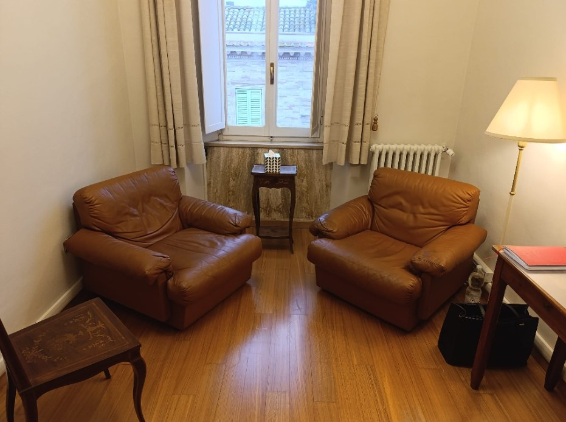

# Sito Web — Dott.ssa Michela Lorenzini, Psicologa

Sito web statico monopage per la Dott.ssa Michela Lorenzini, psicologa a Loreto (AN).  
Realizzato in **HTML5 + CSS3 puro**, senza framework, librerie JavaScript o analytics.  
Non richiede un server: basta aprire `index.html` in un browser, oppure caricare i file su qualsiasi hosting statico.

---

## Struttura del progetto

```
MichishWebsite/
│
├── index.html          # Unica pagina HTML del sito
├── style.css           # Tutto il CSS (variabili, layout, responsive)
├── README.md           # Questo file
│
└── images/
    └── stanza.jpg      # Foto dello studio professionale (da aggiungere manualmente)
```

---

## Come aggiungere la foto della stanza

1. Salvare la foto della stanza come `images/stanza.jpg`  
   (creare la cartella `images/` se non esiste già).
2. Il nome del file deve essere esattamente `stanza.jpg` oppure aggiornare  
   il percorso nell'attributo `src` del tag `` in `index.html`:
   ```html
   
   ```

---

## Struttura della pagina (`index.html`)

Il file è suddiviso in sezioni commentate:

| Sezione HTML        | ID ancora       | Descrizione                                                  |
|---------------------|-----------------|--------------------------------------------------------------|
| `<nav>`             | —               | Barra di navigazione fissa in cima, con link alle sezioni   |
| `<header>`          | `#home`         | Hero: nome, titolo "Psicologa", sottotitolo, foto stanza     |
| `<section>` (1)     | `#chi-sono`     | Presentazione e timeline del percorso formativo              |
| `<section>` (2)     | `#cosa-faccio`  | Tre card con i servizi offerti                               |
| `<footer>`          | `#contatti`     | Telefono, email, sede, modalità, numero albo, copyright      |

---

## Struttura del CSS (`style.css`)

Il file è organizzato in blocchi numerati e commentati:

| Blocco | Contenuto                                                       |
|--------|-----------------------------------------------------------------|
| 1      | Variabili CSS (colori, font, spaziature) — modificare qui per cambiare la palette |
| 2      | Reset e stili base (box model, scroll fluido, corpo testo)      |
| 3      | Navbar (sticky, flex, link con hover)                           |
| 4      | Hero (sfondo navy, nome, titolo corsivo, foto con crop)         |
| 5      | Layout comune (sezioni, container centrato, titoli, divisori)   |
| 6      | Sezione "Chi Sono" (intro, sottotitolo, timeline con pallini)   |
| 7      | Sezione "Di Cosa Mi Occupo" (griglia 3 card con hover)          |
| 8      | Sezione "Contatti" / footer (lista contatti, link tel/email)    |
| 9      | Media query responsive (breakpoint 700px per mobile)            |

---

## Font utilizzati (Google Fonts)

Caricati via CDN in `<head>`, non richiedono installazione locale.

| Font               | Utilizzo                                              |
|--------------------|-------------------------------------------------------|
| **Cinzel**         | Nome, titoli di sezione, etichette — stile biglietto  |
| **Great Vibes**    | "Psicologa" e "Riceve su appuntamento" — corsivo      |
| **Cormorant Garamond** | Tutto il corpo del testo — elegante e leggibile   |

---

## Palette colori

Definita nelle variabili CSS in `:root` dentro `style.css`.

| Variabile           | Valore      | Utilizzo                                  |
|---------------------|-------------|-------------------------------------------|
| `--navy`            | `#1e2d4a`   | Sfondo navbar, hero, footer contatti       |
| `--beige`           | `#c8b49a`   | Accenti, bordi, testo "Psicologa"          |
| `--beige-light`     | `#ede6db`   | Sfondo sezione "Chi Sono"                  |
| `--cream`           | `#f5f0ea`   | Sfondo sezione "Di Cosa Mi Occupo"         |
| `--text-light`      | `#ede6db`   | Testo su sfondi scuri (navy)               |
| `--text-dark`       | `#1e2d4a`   | Testo su sfondi chiari                     |

---

## Come aggiornare i testi

Tutti i testi sono scritti direttamente in `index.html`, senza CMS o database.  
Trovare la sezione da modificare grazie ai commenti `<!-- ===... -->` e aggiornare il contenuto.

### Aggiungere gli anni alla timeline formazione

In `index.html`, ogni voce della timeline ha un elemento:
```html
<span class="timeline-year">···</span>
```
Sostituire `···` con l'anno effettivo, ad esempio:
```html
<span class="timeline-year">2018</span>
```
Su mobile gli anni vengono nascosti automaticamente (spazio insufficiente).

---

## Come pubblicare il sito

Essendo un sito statico (solo file HTML/CSS), può essere pubblicato gratuitamente su:

- **GitHub Pages** — carica i file in un repository pubblico e attiva Pages nelle impostazioni
- **Netlify** — trascina la cartella del progetto su netlify.com/drop
- **Vercel** — collega il repository GitHub e fa il deploy automatico
- **Altervista / Aruba / Netsons** — carica via FTP nella cartella `public_html`

Non sono necessari PHP, database o configurazioni server particolari.

---

## Cookie e Privacy

Il sito non utilizza cookie, analytics o script di terze parti.  
**Non è richiesto alcun banner cookie** (GDPR compliance automatica per siti statici puri).

Se in futuro si aggiungono Google Analytics o altri servizi di tracciamento,  
sarà necessario implementare un banner di consenso.
